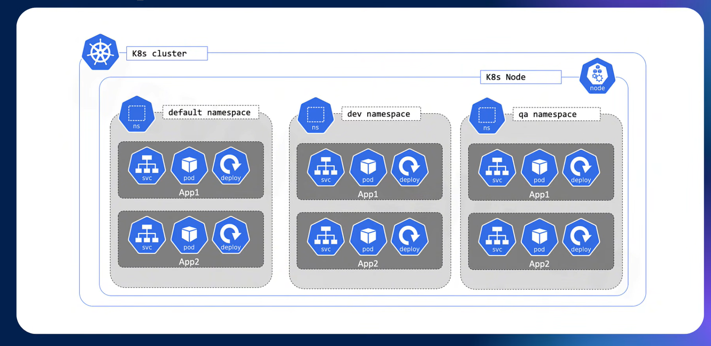

# Namespace trong Kubernetes

## Namespace trong k8s là gì ? 

Trong k8s, Namespace là một cách tổ chức và phân tách các tài nguyên trong 1 cụm k8s để quản lý tốt hơn. Nó được sử dụng để chia nhỏ tài nguyên của 1 cụm lớn thành các không gian làm việc logic nhỏ hơn, giúp dễ dàng quản lý và vận hành hơn 



## Thực hành 
Khi ta cài đặt cụm k8s sẽ có 1 namespace có sẵn là default 

```bash
devops@k8s-master-01:~$ kubectl get pod
No resources found in default namespace.
devops@k8s-master-01:~$ kubectl get pod --namespace default
No resources found in default namespace.
```

Kiểm tra các namespace mặc định có sẵn trên cụm k8s

```bash
devops@k8s-master-01:~$ kubectl get ns
NAME              STATUS   AGE
default           Active   9m21s
kube-node-lease   Active   9m21s
kube-public       Active   9m21s
kube-system       Active   9m21s
```

Tiến hành tạo 1 ns mới bằng CLI: 

```bash
kubectl create ns project-1
```

Tiến hành xóa 1 ns bằng CLI: 

```bash
kubectl delete ns project-1
```

Tạo 1 ns mới bằng file yaml: 

```bash
mkdir -p ~/project/project-1
cd ~/project/project-1/
```

```bash
vim ns.yaml
```

```yaml
apiVersion: v1
kind: Namespace
metadata:
  name: project-1
```

Apply: 

```bash
kubectl apply -f ~/project/project-1/ns.yaml
```

Kiểm tra: 

```bash
devops@k8s-master-01:~/project/project-1$ kubectl get ns
NAME              STATUS   AGE
default           Active   14m
kube-node-lease   Active   14m
kube-public       Active   14m
kube-system       Active   14m
project-1         Active   7s
```

Ta cũng có thể xóa namespace bằng cách sau: 

```bash
kubectl delete -f ns.yaml
```

Giới hạn tài nguyên cho namespace:

```bash
vim resourcequota.yaml
```

```yaml
apiVersion: v1
kind: ResourceQuota
metadata:
  name: mem-cpu-quota
  namespace: project-1
spec:
  hard:
    requests.cpu: "2"
    requests.memory: 4Gi
```

Apply: 

```bash
kubectl apply -f resourcequota.yaml
```