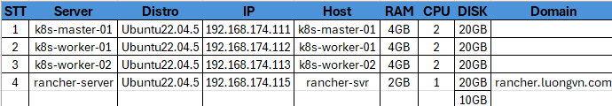
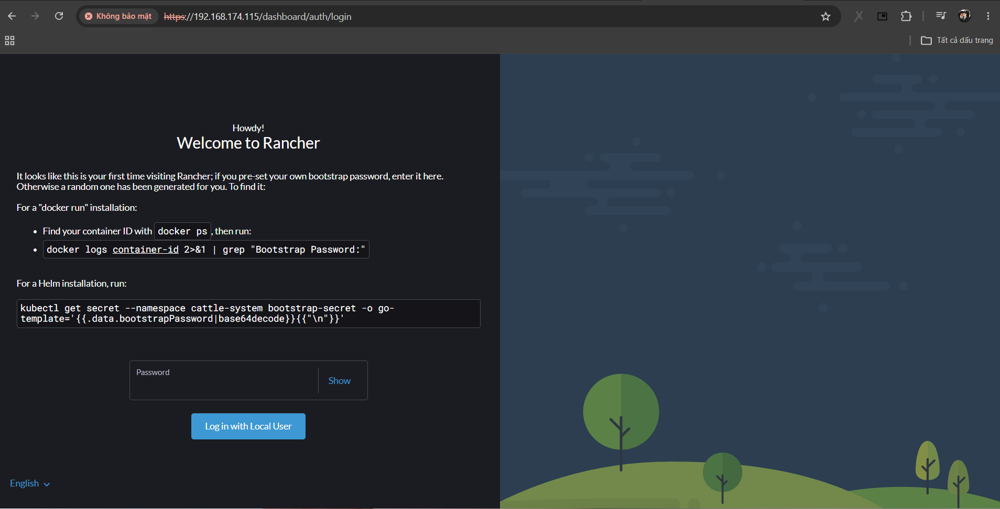
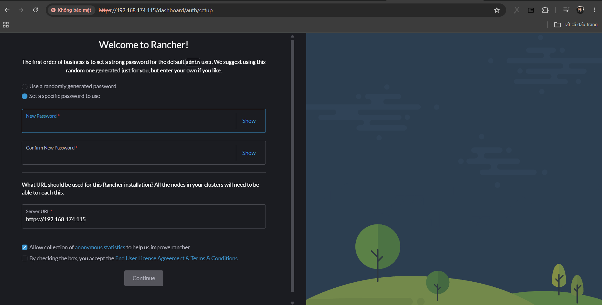
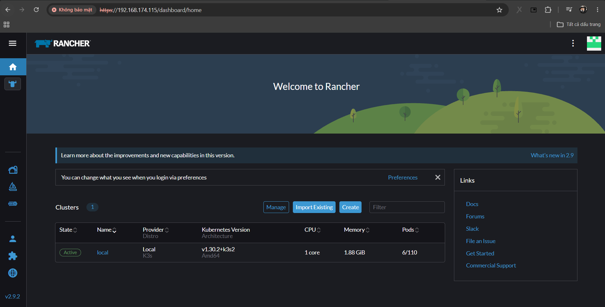
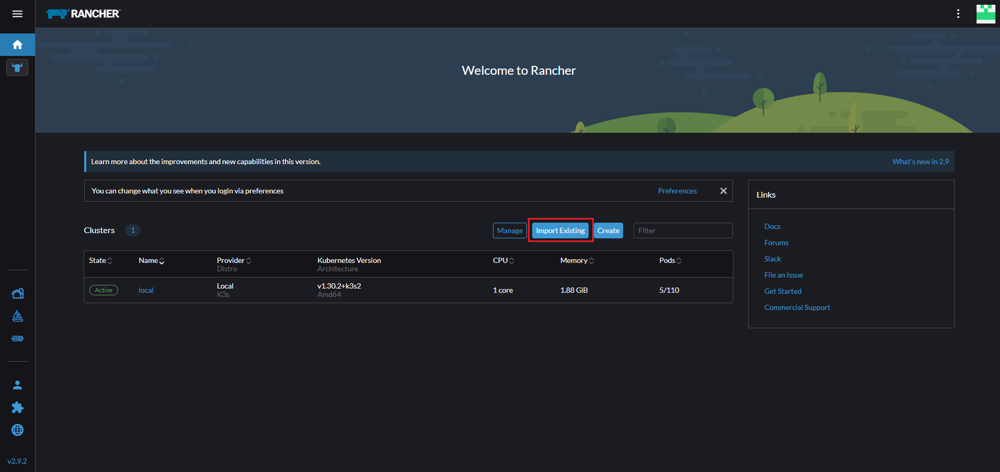
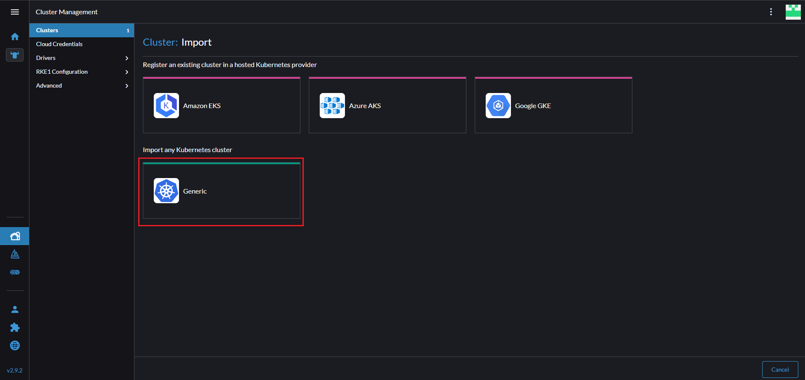
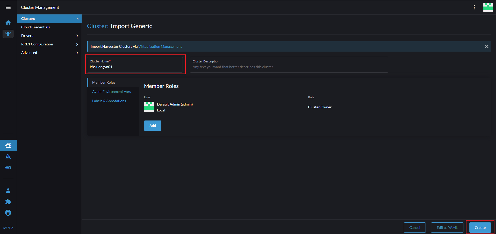
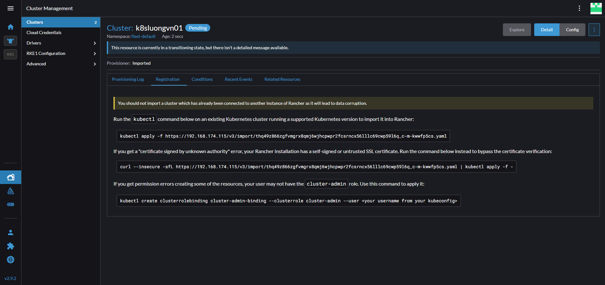
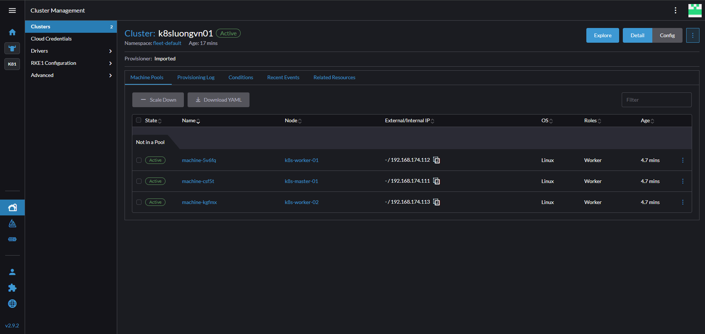
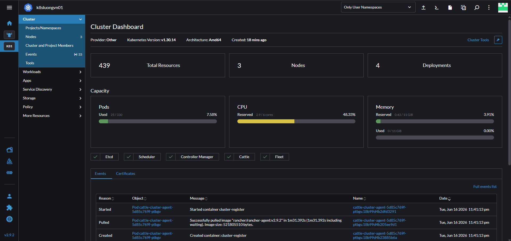

# Cài đặt Rancher và quản lý Kubernetes 

## Rancher là gì ? 
Rancher là 1 công cụ triển khai, quản lý và giám sát nhiều cụm k8s trên các môi trường khác nhau, bao gồm cả On-premis và trên các nhà cung cấp dịch vụ cloud như AWS, Azure, Google Cloud, ... 

## Các cách cài đặt Rancher

Ta có thể cài Rancher bằng Docker hoặc cài đặt ngay trên cụm K8s 

## Cài đặt Rancher bằng Docker 

### Phân hoạch địa chỉ IP 



### Cài đặt Rancher 

Thông tin về disk trên `rancher-svr`: 

```bash
root@rancher-svr:~# df -h
Filesystem                         Size  Used Avail Use% Mounted on
tmpfs                              193M  964K  192M   1% /run
/dev/mapper/ubuntu--vg-ubuntu--lv   18G  6.6G   11G  39% /
tmpfs                              964M     0  964M   0% /dev/shm
tmpfs                              5.0M     0  5.0M   0% /run/lock
/dev/sda2                          1.8G  133M  1.5G   9% /boot
tmpfs                              193M  4.0K  193M   1% /run/user/1000
/dev/sdb                           9.8G   24K  9.8G   1% /data
```

Cài đặt Docker vs docker-compose trên `rancher-svr`: 

```bash
apt update -y 
apt install -y docker.io
apt install -y docker-compose
```

Kiểm tra: 

```bash
root@rancher-svr:~# docker -v && docker-compose -v
Docker version 29.1.3, build 29.1.3-0ubuntu3~22.04.2
docker-compose version 1.29.2, build unknown
```

Cài đặt Rancher bằng docker: 

```bash
mkdir /data/rancher 
cd /data/rancher
```

```bash
vi docker-compose.yml
```

```yml
version: '3'

services:
  rancher-server:
    image: rancher/rancher:v2.9.2
    container_name: rancher-server
    restart: unless-stopped
    ports:
      - "80:80"
      - "443:443"
    volumes:
      - /data/rancher/data:/var/lib/rancher
    privileged: true
```

```bash
docker-compose up -d
```

Kiểm tra: 

```bash
root@rancher-svr:/data/rancher# docker ps
CONTAINER ID   IMAGE                    COMMAND           CREATED          STATUS          PORTS                                                                          NAMES
506a3a53bc0d   rancher/rancher:v2.9.2   "entrypoint.sh"   32 seconds ago   Up 31 seconds   0.0.0.0:80->80/tcp, [::]:80->80/tcp, 0.0.0.0:443->443/tcp, [::]:443->443/tcp   rancher-server
```

Truy cập từ browser: 



Sử dụng câu lệnh như trên ảnh để xem password với container-id để là `rancher-server`



Sau khi login tiến hành đổi password mới



Thêm domain của rancher server vào file host và truy cập bằng domain đó


### Kết nội cụm k8s lên rancher để quản lý 

Chọn vào `Import Existing`:



Chọn vào `Import Generic`:



Đặt tên cho cụm và chọn create: 





Vì chứng chỉ của ta là tự kí nên ta sẽ chọn lệnh sau: 

```bash
curl --insecure -sfL https://192.168.174.115/v3/import/thq49z866zgfvmgrx8qmj6wjhcpwpr2fcsrncx56lllc69cwp59l6q_c-m-kwwfp5cs.yaml | kubectl apply -f -
```

Thực hiện trên `k8s-master-01`: 

```bash
devops@k8s-master-01:~$ curl --insecure -sfL https://192.168.174.115/v3/import/thq49z866zgfvmgrx8qmj6wjhcpwpr2fcsrncx56lllc69cwp59l6q_c-m-kwwfp5cs.yaml | kubectl apply -f -
clusterrole.rbac.authorization.k8s.io/proxy-clusterrole-kubeapiserver created
clusterrolebinding.rbac.authorization.k8s.io/proxy-role-binding-kubernetes-master created
namespace/cattle-system created
serviceaccount/cattle created
clusterrolebinding.rbac.authorization.k8s.io/cattle-admin-binding created
secret/cattle-credentials-ac7989a created
clusterrole.rbac.authorization.k8s.io/cattle-admin created
Warning: spec.template.spec.affinity.nodeAffinity.requiredDuringSchedulingIgnoredDuringExecution.nodeSelectorTerms[0].matchExpressions[0].key: beta.kubernetes.io/os is deprecated since v1.14; use "kubernetes.io/os" instead
deployment.apps/cattle-cluster-agent created
service/cattle-cluster-agent created
```



