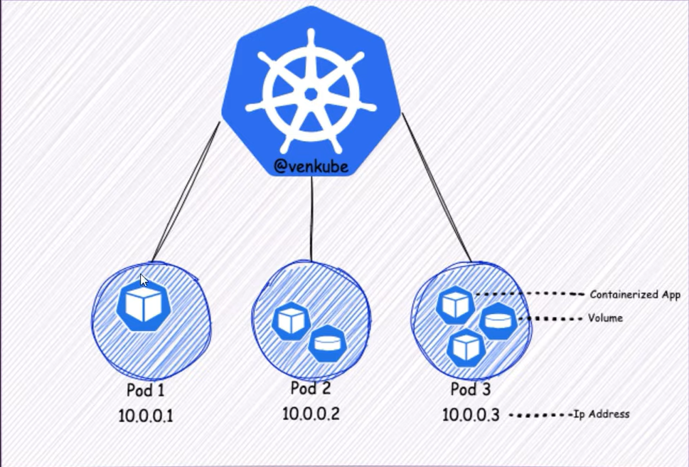

# Pod trong Kubernetes

## Pod là gì ? 
Pod là đơn vị triển khai nhỏ nhất và đơn giản nhất trong k8s, 1 Pod sẽ đại diện cho 1 hoặc nhiều container được nhóm lại với nhau được chia sẻ tài nguyên và mạng 



Ví dụ về file yaml của Pod: 

```yaml 
apiVersion: v1
kind: Pod
metadata: 
  name: nginx
spec: 
  container: 
  - name: nginx
    image: nginx:1.14.2
    ports:
    - containerPort: 80
```

## Triển khai Pod trên cụm k8s

Tạo thư mục prj mới: 

```bash
mkdir ~/project/car-serv
cd ~/project/car-serv
```

Tạo namespace riêng cho dự án `car-serv`: 

```bash
vim ns.yaml
```

```yaml
apiVerison: v1
kind: Namespace
metadata:
  name: car-serv
```

Tạo Pod: 

```bash
vim pod.yaml
```

```yaml
apiVersion: v1
kind: Pod
metadata:
  name: car-serv
  namespace: car-serv
spec:
  containers:
  - name: car-serv
    image: elroydevops/car-serv
    ports:
    - containerPort: 80
```

Apply: 

```bash
kubectl apply -f ~/project/car-serv/ns.yaml
kubectl apply -f ~/project/car-serv/pod.yaml
```

Kiểm tra: 

```bash
devops@k8s-master-01:~/project/car-serv$ kubectl get pod -n car-serv
NAME       READY   STATUS    RESTARTS   AGE
car-serv   1/1     Running   0          30s
```

- `-n car-serv`: chỉ định namespace là car-serv

Ta có thể thực thi vào container của 1 pod bằng câu lệnh sau: 

```bash
kubectl exec -it car-serv -n car-serv -- /bin/bash
```

```bash
devops@k8s-master-01:~/project/car-serv$ kubectl exec -it car-serv -n car-serv -- /bin/bash
root@car-serv:/# ls -l /usr/share/nginx/html/
total 304
-rw-r--r-- 1 root root 11769 Nov 17  2021 404.html
-rw-r--r-- 1 root root   497 May 23  2023 50x.html
-rw-r--r-- 1 root root    95 Jun  7  2023 Dockerfile
-rw-r--r-- 1 root root  1456 Aug 16  2021 LICENSE.txt
-rw-r--r-- 1 root root   538 Nov 17  2021 READ-ME.txt
-rw-r--r-- 1 root root 23028 Nov 17  2021 about.html
-rw-r--r-- 1 root root 17627 Nov 17  2021 booking.html
-rw-r--r-- 1 root root 93370 Nov 17  2021 car-repair-html-template.jpg
-rw-r--r-- 1 root root 15877 Nov 17  2021 contact.html
drwxr-xr-x 2 root root  4096 Jun  7  2023 css
drwxr-xr-x 2 root root  4096 Jun  7  2023 img
-rw-r--r-- 1 root root 39983 Nov 17  2021 index.html
drwxr-xr-x 2 root root  4096 Jun  7  2023 js
drwxr-xr-x 9 root root  4096 Jun  7  2023 lib
drwxr-xr-x 3 root root  4096 Jun  7  2023 scss
-rw-r--r-- 1 root root 25372 Nov 17  2021 service.html
-rw-r--r-- 1 root root 19821 Nov 17  2021 team.html
-rw-r--r-- 1 root root 13797 Nov 17  2021 testimonial.html
```