# Deployment trong Kubernetes

Ta không nên chạy độc lập các Pod mà nên sử dụng các workload, resource như deployment, statefulset. Việc đảm bảo Pod hoạt động đúng và chạy nhiều Pod thì ta sẽ sử dụng Workload Management 

Ta có thê hiểu như sau: Pod đại diện cho nhân viên bán bánh trong tiệm thì Deployment sẽ là chiến lược để bán bánh => khi nhiều người mua ta bố trí nhiều nhân viên và ngược lại 

Khi bạn yêu cầu triển khai 3 Pod mà không may có 1 Pod bị lỗi thì Deployment sẽ tự động tạo thêm 1 Pod mới 

## Khởi tạo 1 Deployment 

Ở đây ta sẽ thử tạo 1 file yaml của Deployment trên Rancher đã cấu hình tử bài trước 

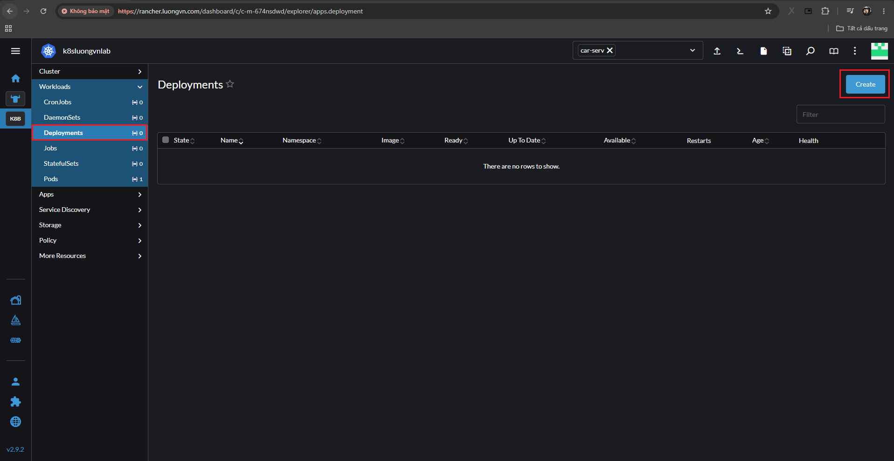

- Chọn deployment sau đó chọn create

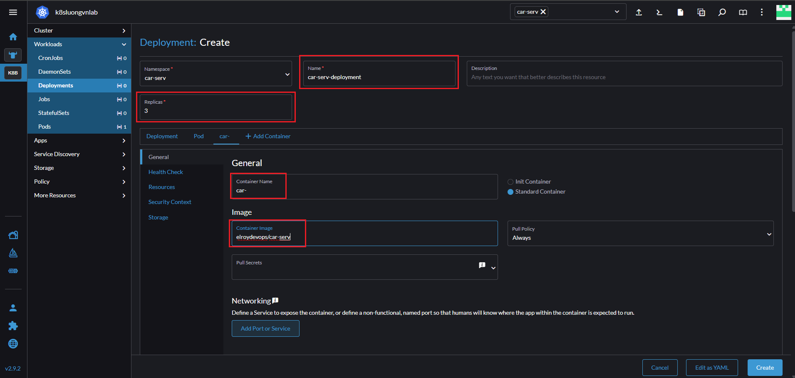

- Đặt tên cho deployment, chỉ định số lượng replicas, đặt tên cho container và chỉ định image 

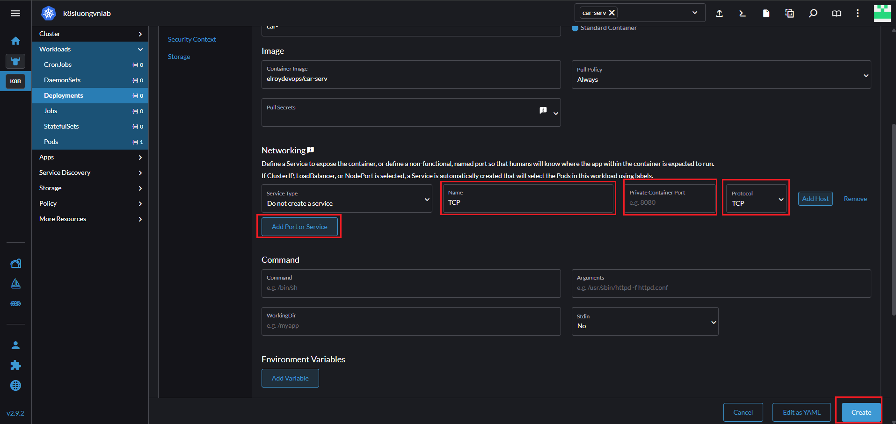

- Chọn Add Port or Service, đặt tên, chỉ định Port, chọn giao thức và chọn Create 

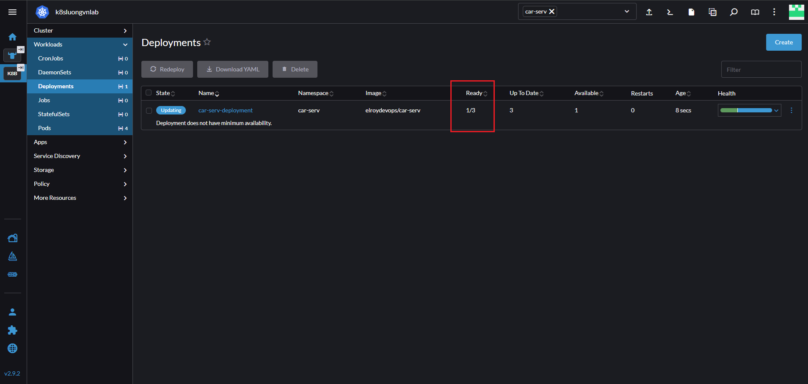

- Ta có thể thấy số lượng Pod được boot 

Sau khi số lượng Replica đã được đúng với ta mong muốn, ta nhấp vào phần Pod dể xem thông tin các Pod: 

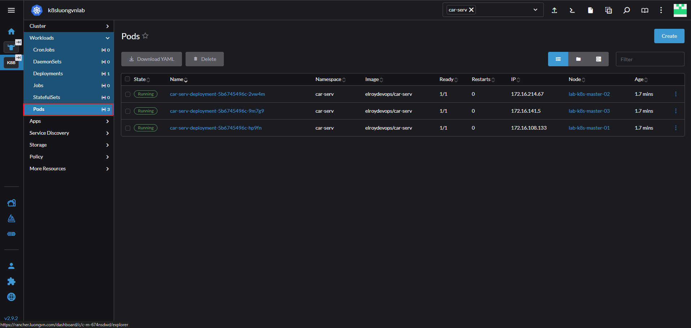

- Ta thấy: 
  - có 3 Pod và cấu hình hoàn toàn giống nhau, ta có thể thử xóa 1 Pod đi để xem quá trình tự động khởi tạo 1 Pod mới 

  - Địa chỉ IP ở đây là địa chỉ IP Internal - IP ở trong cụm k8s, đây là IP của Pod 


Bây giờ ta sẽ tải file yaml của deployment trên Rancher về, xóa những thông tin không cần thiết và lấy về file config hoàn chỉnh: 

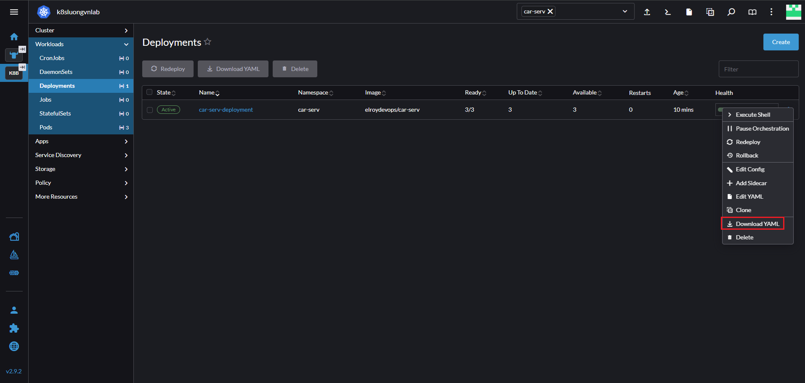

- Chọn download YAML 

```yaml 
apiVersion: apps/v1
kind: Deployment
metadata:
  labels:
    workload.user.cattle.io/workloadselector: apps.deployment-car-serv-car-serv-deployment
  name: car-serv-deployment
  namespace: car-serv
spec:
  replicas: 3
  revisionHistoryLimit: 11
  selector:
    matchLabels:
      workload.user.cattle.io/workloadselector: apps.deployment-car-serv-car-serv-deployment
  template:
    metadata:
      labels:
        workload.user.cattle.io/workloadselector: apps.deployment-car-serv-car-serv-deployment
      namespace: car-serv
    spec:
      containers:
        - image: elroydevops/car-serv
          imagePullPolicy: Always
          name: car-serv
          ports:
            - containerPort: 80
              name: tcp
              protocol: TCP
```

Bây giờ ta sẽ xóa Deployment trên Rancher đi sau đó sẽ import file yaml trên 

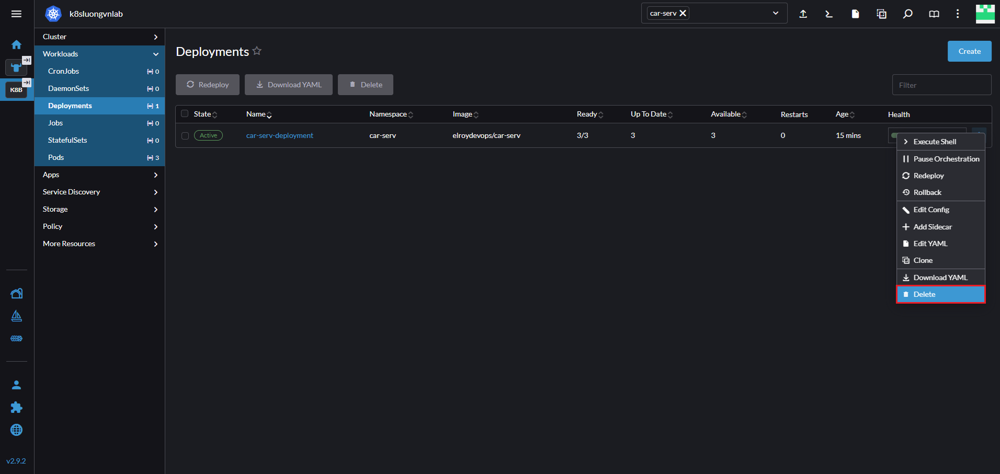

- Chọn delete 

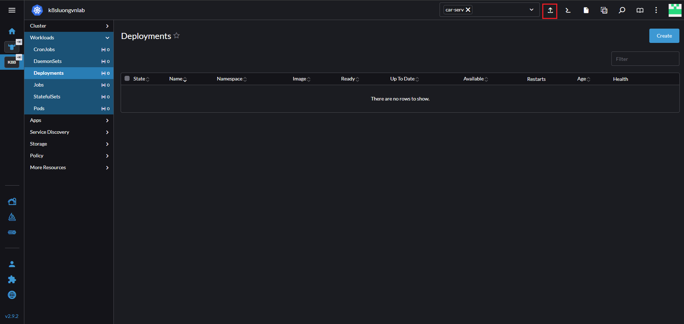

- Chọn import yaml 

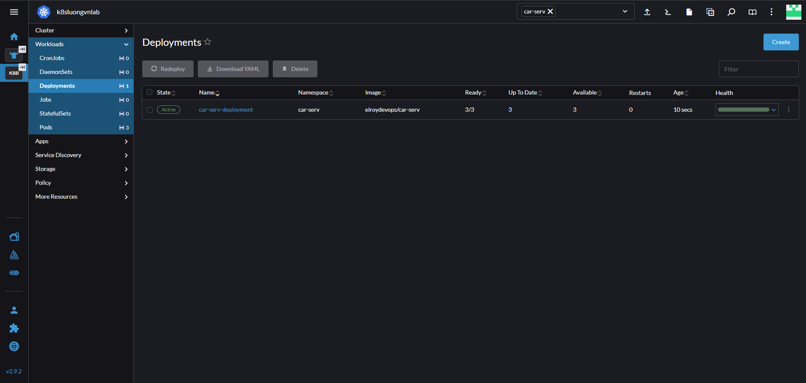

- Ta thấy: Deployment vẫn được triển khai thành công 

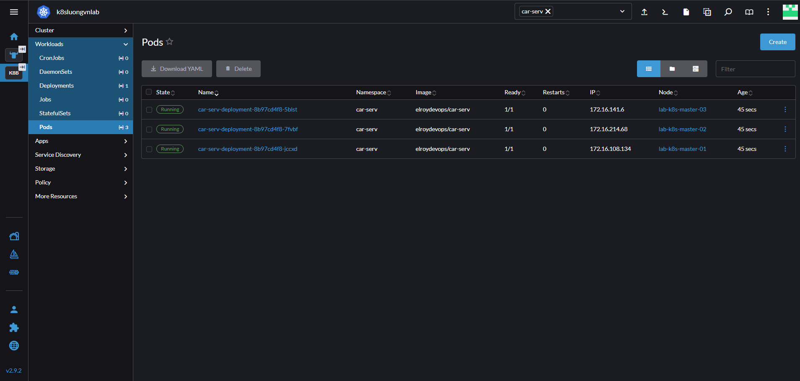

- Đầy đủ số lượng Pod theo replica yêu cầu 

## Mô hình đi từ client -> ingress -> service -> pod

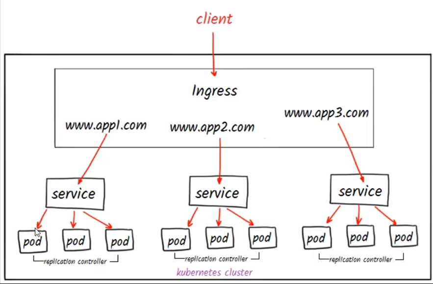

Ta thấy ở đây, không đề cập đến deployment lý do là đi từ bên ngoài vào chỉ xác định được Pod là gì, tức là ta chỉ làm việc với nhân viên chứ ta không biết được chiến lược là ở quầy này có bao nhiêu nhân viên 

Vì vậy khi ta sử dụng deployment thì service sẽ làm việc với deployment để đảm bảo chiến lược đó sẽ đầy đủ nhân viên trong 1 quầy 