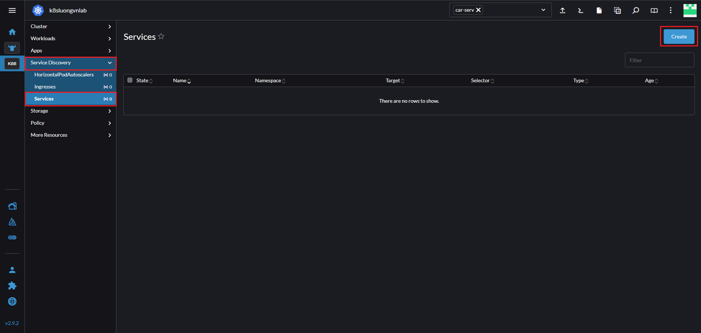
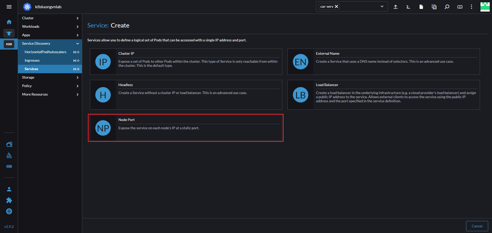
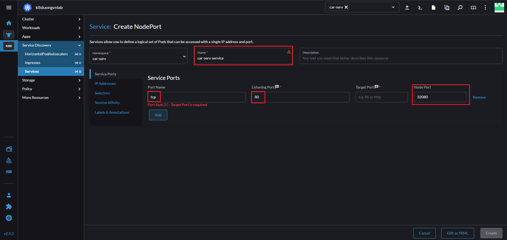
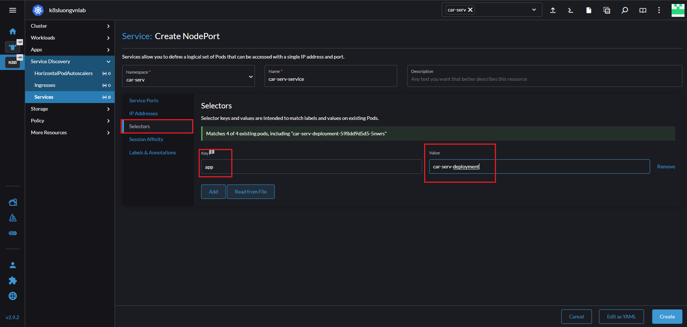
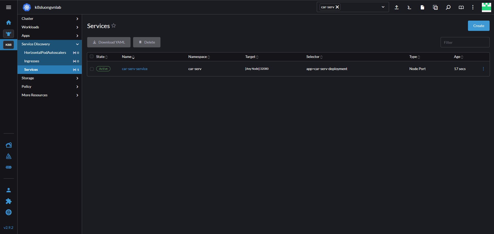
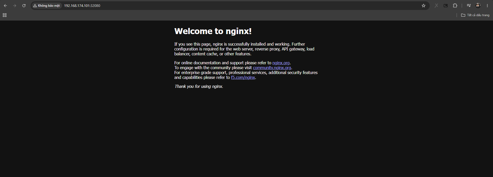

# Service trong Kubernetes 

## Service là gì ? 

Service trong k8s là một đối tượng dùng để định nghĩa cách tiếp cận đến các Pod, thường là 1 nhóm Pod hay chính xác và việc triển khai các Pod qua Deployment trong cụm k8s 

Ta có thể hiểu là: Service như 1 người tư vấn khi ta đi vào tiệm bánh (vì ta không biết được quầy bánh ngọt hay quầy bánh mặn ở vị trí nào trong tiệm). 

> Service đóng vai trò điều phối traffic vào các Pod

## Các loại Service 

**ClusterIP:** Tạo 1 địa chỉ IP chỉ có thể truy cập được ở trong cụm, tài nguyên ở trong cụm có thể giao tiếp với nhau nhưng bên ngoài thì không. Ta sẽ phải expose ra bên ngoài bằng việc sử dụng `Ingress` hoặc `Gateway` 

**NodePort:** Mở 1 port trực tiếp từ ứng dụng ra bên ngoài -> Ta có thể truy cập vào ứng dụng không thông qua cửa nào khác 

**LoadBalancer:** Service này sẽ thường dành cho CLoud Provider. LB sẽ điều phối lưu lượng tới các Pod tương ứng 

**ExternalName:** Liên kết với 1 tên miền ở bên ngoài 

## NodePort 

Mặc định với NodePort ta sẽ chỉ sử dụng được các port từ 30000 -> 32767. 

Ta sẽ tạo 1 service là NodePort trên Rancher 

- Chọn ServiceDiscovery, Services sau đó chọn Create 

- Chọn NodePort 

- Đặt tên cho service, đặt tên cho port, chỉ định port trong container, chỉ định port expose ra ngoài 

- Nhấp vào Selectors để chỉ định deployment, sau đó nhập key vs value của deployment, sau đó chọn Create 

Truy cập từ bên ngoài: 

## ClusterIP 

