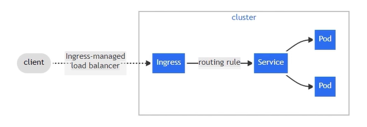
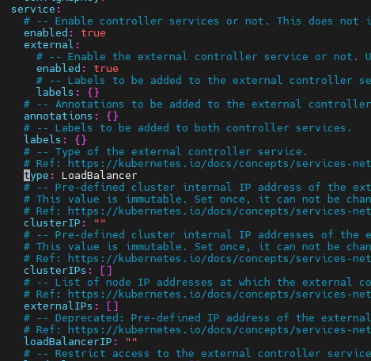

# Ingress trong Kubernetes

Ingress là 1 tài nguyên dùng để quản lý cách thức truy cập từ bên ngoài vào các service bên trong cụm k8s. Ingress giúp định hướng lưu lượng truy cập HTTP/HTTPs tới các service nội bộ 



Ta có thể đưa black list hoặc white list những địa chỉ IP ta muốn cho vào hoặc cấm 

Ta phải có Ingress Controller, nếu chỉ tạo ingress không thôi thì hoàn toàn vô nghĩa 

## Ingress Controller

Ta có thể hiểu IC là 1 người bảo vệ đừng ngoài cửa, theo mô hình tiệm bánh thì ingress chính là cửa tiệm và IC chính là người bảo vệ đứng ở cửa tiệm đó 

Có rất nhiều loại Ingress Controller như: 

- NGINX Ingress Controller
- HAProxy Ingress
- Kong Ingress Controller 

## Overview Helm to Install Ingress Nginx Controller 

Helm là 1 công cụ quản lý các gói tài nguyên (Package Manager), giống như ta chạy `apt install` trên ubuntu thì Helm cũng tương tự nhưng nó phục vụ cho môi trường K8s

**Ví dụ:** 

```bash
apt install nginx # cài nginx trên sv ubuntu
helm install ingress nginx # cài ingress nginx trên cụm k8s
```

Trong Helm các gói sẽ được gọi là Charts

```bash
mychart/
  Chart.yaml
  values.yaml
  charts/
  templates/
  ...
```

### Install Helm 

Thực hiện trên `master-01`: 

```bash
wget https://get.helm.sh/helm-v3.21.2-linux-amd64.tar.gz
```

giải nén: 

```bash
tar xvf helm-v3.21.2-linux-amd64.tar.gz
```

Di chuyển helm vào `/usr/bin`: 

```bash
mv linux-amd64/helm /usr/bin/
```

Kiểm tra: 

```bash
root@lab-k8s-master-01:~# helm version
version.BuildInfo{Version:"v3.21.2", GitCommit:"125963406833fe0525be91f46c8b5b0f22fb9e32", GitTreeState:"clean", GoVersion:"go1.26.4"}
```

### Install Ingress Nginx

Add repo (chart) của nginx ingress 

```bash
helm repo add ingress-nginx https://kubernetes.github.io/ingress-nginx/
helm repo update 
```

```bash
root@lab-k8s-master-01:~# helm search repo nginx
NAME                            CHART VERSION   APP VERSION     DESCRIPTION
ingress-nginx/ingress-nginx     4.15.1          1.15.1          Ingress controller for Kubernetes using NGINX a...
```

Ta có thể kéo cái repo vừa add về: 

```bash
helm pull ingress-nginx/ingress-nginx
```

```bash
tar xvf ingress-nginx-4.15.1.tgz
```

```bash
root@lab-k8s-master-01:~# ls ingress-nginx
Chart.yaml  OWNERS  README.md  README.md.gotmpl  changelog  ci  cloudbuild.yaml  templates  tests  values.yaml
root@lab-k8s-master-01:~# ls ingress-nginx/templates/
NOTES.txt                               controller-configmap-tcp.yaml         controller-keda.yaml                 controller-service-metrics.yaml        default-backend-networkpolicy.yaml
_helpers.tpl                            controller-configmap-udp.yaml         controller-networkpolicy.yaml        controller-service-webhook.yaml        default-backend-poddisruptionbudget.yaml
_params.tpl                             controller-configmap.yaml             controller-poddisruptionbudget.yaml  controller-service.yaml                default-backend-service.yaml
admission-webhooks                      controller-daemonset.yaml             controller-prometheusrule.yaml       controller-serviceaccount.yaml         default-backend-serviceaccount.yaml
clusterrole.yaml                        controller-deployment.yaml            controller-role.yaml                 controller-servicemonitor.yaml
clusterrolebinding.yaml                 controller-hpa.yaml                   controller-rolebinding.yaml          default-backend-deployment.yaml
controller-configmap-addheaders.yaml    controller-ingressclass-aliases.yaml  controller-secret.yaml               default-backend-extra-configmaps.yaml
controller-configmap-proxyheaders.yaml  controller-ingressclass.yaml          controller-service-internal.yaml     default-backend-hpa.yaml
```

- Ta thấy có 1 file values.yaml và trong template có rất nhiều file yaml 

Mở file values.yaml và tìm kiếm từ khóa `type`



- Ta thấy ở đây có 1 từ khóa là `LoadBalancer` mặc định type này có thể sử dụng được trên môi trường cloud, còn trên môi trường ON-Premis ta sẽ đổi thành `NodePort`

- Thêm port để expose NodePort ở `external` với `http` vs `https` (30000 - 32767), ở đây tôi để là `30080` vs `30443`


Lưu file và copy thư mục vào `/home/devops`: 

```bash
cp -rf ingress-nginx /home/devops/
```

```bash
devops@lab-k8s-master-01:~$ ll ingress-nginx/
total 164
drwxr-xr-x 6 root   root    4096 Jun 21 16:23 ./
drwxr-x--- 5 devops devops  4096 Jun 21 16:23 ../
-rw-r--r-- 1 root   root     355 Jun 21 16:23 .helmignore
-rw-r--r-- 1 root   root     646 Jun 21 16:23 Chart.yaml
-rw-r--r-- 1 root   root      89 Jun 21 16:23 OWNERS
-rw-r--r-- 1 root   root   56100 Jun 21 16:23 README.md
-rw-r--r-- 1 root   root   11877 Jun 21 16:23 README.md.gotmpl
drwxr-xr-x 2 root   root    4096 Jun 21 16:23 changelog/
drwxr-xr-x 2 root   root    4096 Jun 21 16:23 ci/
-rw-r--r-- 1 root   root     248 Jun 21 16:23 cloudbuild.yaml
drwxr-xr-x 3 root   root    4096 Jun 21 16:23 templates/
drwxr-xr-x 3 root   root    4096 Jun 21 16:23 tests/
-rw-r--r-- 1 root   root   53643 Jun 21 16:23 values.yaml
```

Install ingress-nginx 

**Cú pháp:** 

```bash
helm -n <namespace> install <release name> -f ingress-nginx/values.yaml <helm chart> 
```

Tạo namespace mới cho ingress nginx 

```bash
kubectl create ns ingress-nginx
```

install ingress nginx: 

```bash
helm -n ingress-nginx install ingress-nginx -f ingress-nginx/values.yaml ingress-nginx
```

```bash
devops@lab-k8s-master-01:~$ helm -n ingress-nginx install ingress-nginx -f ingress-nginx/values.yaml ingress-nginx
NAME: ingress-nginx
LAST DEPLOYED: Sun Jun 21 16:42:18 2026
NAMESPACE: ingress-nginx
STATUS: deployed
REVISION: 2
TEST SUITE: None
NOTES:
The ingress-nginx controller has been installed.
Get the application URL by running these commands:
  export HTTP_NODE_PORT=30080
  export HTTPS_NODE_PORT=30443
  export NODE_IP="$(kubectl get nodes --output jsonpath="{.items[0].status.addresses[1].address}")"

  echo "Visit http://${NODE_IP}:${HTTP_NODE_PORT} to access your application via HTTP."
  echo "Visit https://${NODE_IP}:${HTTPS_NODE_PORT} to access your application via HTTPS."

An example Ingress that makes use of the controller:
  apiVersion: networking.k8s.io/v1
  kind: Ingress
  metadata:
    name: example
    namespace: foo
  spec:
    ingressClassName: nginx
    rules:
      - host: www.example.com
        http:
          paths:
            - pathType: Prefix
              backend:
                service:
                  name: exampleService
                  port:
                    number: 80
              path: /
    # This section is only required if TLS is to be enabled for the Ingress
    tls:
      - hosts:
        - www.example.com
        secretName: example-tls

If TLS is enabled for the Ingress, a Secret containing the certificate and key must also be provided:

  apiVersion: v1
  kind: Secret
  metadata:
    name: example-tls
    namespace: foo
  data:
    tls.crt: <base64 encoded cert>
    tls.key: <base64 encoded key>
  type: kubernetes.io/tls
```

Ta nên lưu lại cấu hình template ví dụ này: 

```bash
apiVersion: networking.k8s.io/v1
kind: Ingress
metadata:
  name: example
  namespace: foo
spec:
  ingressClassName: nginx
  rules:
    - host: www.example.com
      http:
        paths:
          - pathType: Prefix
            backend:
              service:
                name: exampleService
                port:
                  number: 80
            path: /
  # This section is only required if TLS is to be enabled for the Ingress
  tls:
    - hosts:
      - www.example.com
      secretName: example-tls
```

```bash
devops@lab-k8s-master-01:~$ kubectl get all -n ingress-nginx
NAME                                           READY   STATUS    RESTARTS   AGE
pod/ingress-nginx-controller-d6f5f6d89-2qzl7   1/1     Running   0          19m

NAME                                         TYPE        CLUSTER-IP       EXTERNAL-IP   PORT(S)                      AGE
service/ingress-nginx-controller             NodePort    10.110.40.127    <none>        80:30080/TCP,443:30443/TCP   19m
service/ingress-nginx-controller-admission   ClusterIP   10.100.178.194   <none>        443/TCP                      19m

NAME                                       READY   UP-TO-DATE   AVAILABLE   AGE
deployment.apps/ingress-nginx-controller   1/1     1            1           19m

NAME                                                 DESIRED   CURRENT   READY   AGE
replicaset.apps/ingress-nginx-controller-d6f5f6d89   1         1         1       19m
```

