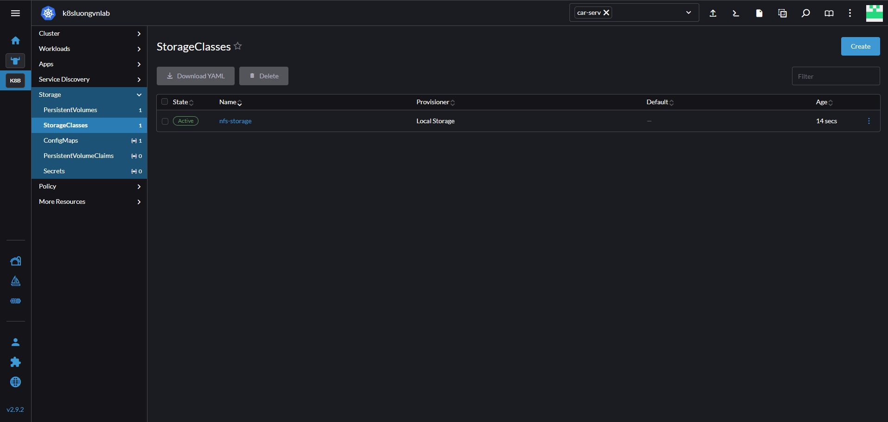

# Storage class 

Storage class là 1 đối tượng trong Kubernetes giúp định nghĩa các loại lưu trữ khác nhau 

Ví dụ tiệm bánh: Storage class giống như các loại kho hàng khác nhau trong tiệm bánh để lưu trữ bánh và các vật phẩm liên quan, tùy váo tính chất của từng kho tiệm sẽ chọn loại kho phù hợp với từng mục đích, storage class 1 là kho lạnh để lưu trữ bánh kem, storage class 2 là kho khô để lưu trữ bánh ngọt bánh mặn

Ví dụ trường học: khi đi học ở trường học thì trường học sẽ chia thành nhiều khối, khối học sinh giỏi, khối phổ thông, ... 

Nếu chúng ta muốn lưu trữ các ứng dụng yêu cầu tốc độ đọc ghi nhanh thì ta cần storage class lưu trữ kiểu ssd, các ứng dụng lưu trữ lâu dài mà không cần tốc độ truy cập nhanh thì ta cần storage class kiểu hdd

## Volume Binding Mode 

VolumeBindingMode là một thuộc tính trong StorageClass, quyết định PVC sẽ được bind với PV khi nào 

Có 2 giá trị chính: 

- Immediate: K8s sẽ tạo ngay PVC mà không cần chờ Pod nào yêu cầu sử dụng 
- WaitForFirstConsumer: K8s chưa tạo PV, nó chờ Scheduler chọn Node chạy Pod sau đó mới tạo PVC 

## Tạo StorageClass 

```yaml
apiVersion: storage.k8s.io/v1
kind: StorageClass
metadata: 
  name: nfs-storage
provisioner: kubernetes.io/no-provisioner
volumeBindingMode: WaitForFirstConsumer
```

