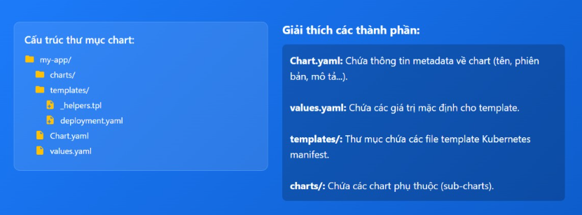

# Tổng quan về helm 

## Helm là gì ? 

Helm là công cụ quản lý gói và quản lý vòng đời ứng dụng dành cho Kubernetes, cho phép đóng gói nhiều tài nguyên Kubernetes (Deployment, Service, Ingress, ConfigMap, ...) thành một đơn vị triển khai logic duy nhất gọi là Helm Chart để cài đặt, nâng cấp và roll back bằng command. 

Về bản chất, Helm đóng vài trò "Kubernetes package manager", giúp định nghĩa, chia sẻ và triển khai các ứng dụng từ chart lưu trữ trong repository, đồng thời ghi nhận mỗi lần cài đặt như 1 release riêng biệt để dễ quản lý cấu hình và lịch sử triển khai trên nhiều môi trường khác nhau 

## Helm Chart là gì ? 
Helm Chart là gói cấu hình dùng cho Kubernetes, đóng gói toàn bộ manifest (YAML) và thiết lập cần thiết để triển khai 1 ứng dụng hoặc 1 stack dịch vụ lên cluster dưới dạng 1 đơn vị duy nhất 

Mỗi chart mô tả tập tài nguyên kubernetes liên quan, cho phép cài đặt, tùy biến cấu hình và quản lý vòng đời ứng dụng thông qua các lệnh helm mà không cần thao tác trực tiếp với từng file YAML rời rạc 

## Thành phần cơ bản của Helm 

Thành phần cơ bản của Helm bao gồm: 

- Helm Client (CLI) để người dùng thao tác 
- Helm Library để xử lý chart và tương tác với Kubernetes
- Cấu trúc và thành phần bên trong Helm Chart 
- Kubernetes API Server làm điểm kết nối với cluster.

### Helm Client (CLI) 

Helm Client là công cụ dòng lệnh mà người dùng sử dụng để làm việc với Helm, bao gồm tạo chart, quản lý repo và cài đặt, nâng cấp, rollback hoặc gỡ bỏ các release trên K8s cluster. 

Nó cũng cung cấp các command như: 
- helm install 
- helm upgrade
- helm rollback
- helm list

Có thể thực hiện trên máy vận hành hoặc trong CICD 

### Helm Library 

là lớp thư viện được viết bằng Go, sử dụng k8s client library để giao tiếp với k8s API server nhẳm triển khai, cập nhật và xóa tài nguyên ứng dụng dựa trên chart

### Cấu trúc và thành phần bên trong Helm Chart 

Một Helm Chart là thư mục hoặc gói nén `.tgz` chứa toàn bộ định nghĩa tài nguyên Kubernetes dưới dạng template và cấu hình đi kèm

Các thành phần chính gồm: 
- `Chart.yaml`: Lưu metadata của chart như tên, phiên bản, mô tả, dependency
- `values.yaml`: Chứa giá trị mặc định cho các biến trong template, có thể bị ghi đè khi cài đặt hoặc nâng cấp 
- `folder templates/`: Chứa các file YAML sử dụng Go templating để sinh ra Deployment, Service, Ingress, ConfigMap, Secret, ... 
- `folder charts/`: Dùng lưu các chart phụ thuộc(sub chart) nếu ứng dụng gồm nhiều thành phần 

